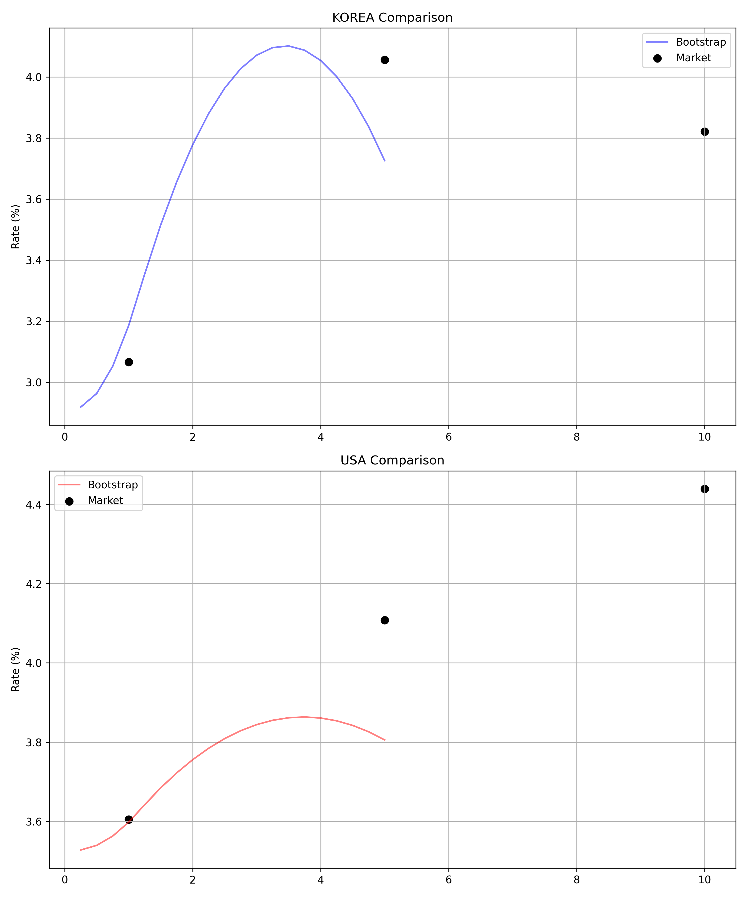

# GPU 가속 기반 멀티 모델 Callable Swap 통합 평가 및 최적화 엔진
> **NVIDIA CUDA 기반 고성능 몬테카를로 시뮬레이션 및 HW, LMM calibration 및 자산 평가 시스템**

> **Language**: [English](./README.md) | [한국어]

- 한국(KRW)과 미국(USD) 시장의 **Bermudan Callable Swap**의 가치를 GPGPU를 활용하여 고속으로 계산하는 것을 목적으로 함
- GARCH 분석 및 Batch Calibration을 결합하여, Hull-White 모델과 LMM 모델의 Greeks 및 Hedge ratio를 계산함
- Longstaff-Schwartz (LSM) 알고리즘을 이용하여 최적 조기행사 경계(Optimal Exercise Boundary)를 산출하고 가격을 결정
- 프록시를 이용한 multi curve 도입
---

## 프로젝트 구조 및 파일별 상세 역할
총 4개의 레이어로 구성되어 있으며, 데이터 수집, 최적화, 가격 계산 엔진, 실행파일로 구성되어 있음

| 레이어 | 파일명 | 상세 역할                                                                                                                                                                                                          |
| :--- | :--- |:---------------------------------------------------------------------------------------------------------------------------------------------------------------------------------------------------------------|
| **Data** | `Datahandler.py` | **데이터 수집 및 처리**: ECOS(한국은행) 및 yfinance API를 이용하여 당일 기준 1년, 5년 10년 만기 국고채(OIS 프록시)의 10일분 데이터 수집. 가장 최근 스냅샷과 과거 데이터를 dictionary 형태로 반환. 1Y, 5Y, 10Y 국고채 프록시 금리 데이터와 전일 KOFR 및 SOFR 초단기 금리를 이용하여 OIS curve 구현.    |
| | `Volatility.py` | **통계 분석 엔진**: Datahandler에서 수집된 데이터를 기반으로 GARCH(1,1) 및 EWMA fitting 수행. 향후 최적화를 위한 초기값 생성.                                                                                                                     |
| **Optimization** | `HW_cal.py` / `LMM_cal.py` | **이중 켈리브레이터**: 주어진 Swaption 가격을 기준으로 Gauss-Newton 최적화를 수행.                                                                                                                                                     |
| **Engine** | `Model_selection.py` | **수익률 곡선 구축**: QuantLib을 이용하여 yield curve를 부트스트래핑함.                                                                                                                                                            |
| | `HW_GPU.py` / `LMM_GPU.py` | **병렬 시뮬레이터**: 주어진 파라미터를 이용하여 이자율 경로 생성. Hull-White 및 LMM를 CUDA를 이용하여 계산. LMM은 Rebonato Parametrization ($\rho_{ij} = e^{-\beta \times \left\vert T_{i} - T_{j} \right\vert}$)을 이용하고 Cholesky decomposition 사용. |
| | `LSM_pricer.py` / `LSM_pricer_LMM.py` | **조기행사 결정 엔진**: GPU 내에서 LSM 수행.                                                                                                                                                                                |
| **Controller** | `main.py` | **실행 파일**                                                                                                                                                                                                      |

`Datahandler.py` → `Volatility.py` → `Model_selection.py` → `HW_cal.py / LMM_cal.py` → `HW_GPU.py / LMM_GPU.py` → `LSM_pricer.py / LSM_pricer_LMM.py`

---
## Multi-Curve Pricing 적용

### 이론적 배경
- Single curve는 미래 현금 흐름을 예측하는 Forward curve 와 이를 현재 가치로 계산하는 Discount curve를 같다고 간주함 (Libor가 risk free rate)
- 2008년 금융 위기 이후 대형 은행의 파산으로 인하여 은행간 신용 위험 (credit risk)와 자금의 유동성 위험 (liquidity risk) 발생
- 이로 인하여 tenor basis가 확대되었으며, 무차익거래 조건이 성립하지 않음으로서 multi curve 도입이 필요해짐

### Swaption에 multi-curve framework 적용이 필요한 이유
- **헤지 비용의 기준**: 무담보 Callable Swap 매도 후 청산소(CCP)에서 반대 포지션을 구축할 때, 헤지 포트폴리오의 조달 비용은 담보부 무위험 금리(OIS/KOFR/SOFR)를 따름
- **현금흐름의 기준**: 스왑 계약서상 변동금리(Floating Leg) 지급 조건은 신용/유동성 위험을 포함한 준거 금리(3M Libor/91일 CD)의 Forward 커브를 따름
- **평가 방법론**: 따라서 복제 가치와 준거 인덱스의 특성을 모두 반영하기 위해, Forward 커브로 예측한 미래 현금흐름을 OIS 커브로 할인하는 멀티 커브 프라이싱이 필수적임

### Hull-White 모델
#### Single curve
- **Model**: $dr_t = \left( \theta(t) - a r_t \right) dt + \sigma dW_t$
- **Discount factor**: $P(t,T) = A(t,T) \exp\left(-B(t,T)r_t\right)$
- **Forward rate**: $F(t; T_1, T_2) = \frac{1}{\tau} \left( \frac{P(t,T_1)}{P(t,T_2)} - 1 \right)$

| 파라미터 기호 | 영문 명칭                | 국문 명칭        | 주요 역할 및 성격                                                                                                                        |
| :---: |:---------------------|:-------------|:----------------------------------------------------------------------------------------------------------------------------------|
| $a$ | Mean Reversion Speed | 평균 회귀 속도     | 단기금리가 장기 평균 수준($\theta(t)/a$)으로 되돌아오는 속도를 결정하는 상수. 값이 클수록 금리가 평균으로 강하게 끌려가며 미래 금리의 변동 범위가 작아짐.                                    |
| $\sigma$ | Volatility           | 단기금리 변동성     | 단기금리에 가해지는 무작위 충격의 크기를 조절하는 상수. 금리 옵션(Swaption, Cap/Floor)의 가격 결정 주요 요인.                                                          |
| $\theta(t)$ | Drift Term           | 결정론적 드리프트 함수 | 시간이 지남에 따라 변하는 시간 의존적 함수(Time-dependent function). 현재 시장에 형성된 초기 이자율 가치 구조(Yield Curve)를 모델이 완벽하게 복제(Exact Calibration)할 수 있도록 함. |

#### Multi curve (실제 구현)
- 단일 커브 환경에서 현재 시장의 준거 금리 곡선(예: 3M CD 선도금리)인 ($f_F(0,t)$)를 모형이 완벽하게 복제(Exact Calibration)하기 위해 요구되는 결정론적 기초 드리프트 항$$\theta_{base}(t) = \frac{\partial f_F(0, t)}{\partial t} + a f_F(0, t) + \frac{\sigma^2}{2a}\left( 1 - e^{-2at} \right)$$
- 연속 복리(Continuous Compounding) 체계 하에서 무위험 할인 채권 가격 테이블 ($P_D(0,t)$)로부터 각 타임스텝 ($\Delta t \cdot (t-1), \Delta t \cdot t$) 구간에 내재된 순수 무위험 순간 선도금리 ($f_D(0,t)$)를 역산 $$f_D(0, t) = -\frac{1}{\Delta t} \ln \left( \frac{P_D(0, t)}{P_D(0, t-\Delta t)} \right)$$
- 시장의 예측 준거 금리(CD 3M 등)와 무위험 할인 금리(KOFR/OIS 등) 사이의 격차인 신용 및 유동성 테너 베이시스 스프레드를 시점별로 추출$$\Delta(t) = f_F(0, t) - f_D(0, t)$$
- 단기금리 시뮬레이션의 기준축을 예측 커브가 아닌 무위험 할인 단기금리 ($r_{t}^{D}$) 과정으로 정렬하기 위한 최종 보정 $$\theta(t) = \theta_{base}(t) + a \Delta(t) = \frac{\partial f_F(0, t)}{\partial t} + a f_D(0, t) + \frac{\sigma^2}{2a}\left( 1 - e^{-2at} \right)$$
- 오일러-마루야마(Euler-Maruyama) 이산화 기법을 사용하여 다음 타임스텝의 무위험 할인 단기금리 경로를 무작위로 전개$$r_{t+\Delta t}^D = r_t^D + \left( \theta(t) - a r_t^D \right) \Delta t + \sigma \sqrt{\Delta t} Z_t$$

### Libor Market Model
#### Single curve

## 데이터 분석 결과 (Final Risk Metrics) ~~향후 수정 예정 (single curve 기반의 과거 데이터)~~
- 입력 데이터는 2026년 05월 11일 기준 ECOS와 yfinance의 1년, 5년 10년 국고채의 10일분 데이터
- 버뮤단 옵션은 행사가 3.5%에 시장 기준 스왑 금리 1.25% 로 설정
- Rebonato Parametrization 의 beta = 1.5 사용

### [KOREA REPORT (KRW)]

| 지표 | Hull-White (HW) | LMM |
| :--- | :---: | :---: |
| **Val (평가가치)** | 3.3588 | 0.9210 |
| **Delta (1bp)** | 1.8299 | 2.6241 |
| **Gamma** | 0.0339 | -0.6263 |
| **Vega** | 1.7867 | 0.1118 |
| **HR (헤지비율)** | 0.4067 | 0.5831 |

### [USA REPORT (USD)]

| 지표 | Hull-White (HW) | LMM |
| :--- | :---: | :---: |
| **Val (평가가치)** | 3.0183 | 1.1385 |
| **Delta (1bp)** | 1.7174 | 2.5285 |
| **Gamma** | -0.0142 | -0.2952 |
| **Vega** | 1.8013 | 0.1155 |
| **HR (헤지비율)** | 0.3816 | 0.5619 |

### 결과 분석
- **Val (평가가치)**: 모델에서 계산한 공정가치로 실제 행사가가 3.5%, 시장 기준 스왑 금리가 1.25%인 Callable swap의 가치
#### HW와 LMM의 비교
1. **Val**: 시장 기준 스왑 금리인 1.25%를 기준으로 한국과 미국 시장 모두 HW는 고평가를, LMM은 저평가를 하고 있음.
2. **Delta**: 한국과 미국 시장 모두 LMM이 HW보다 높은 값을 보이고 있으며 1bp 변화에 따른 파생상품 가격 변화는 LMM이 높다는 것이 확인됨.
3. **Gamma**: HW 모델은 한국 시장과 미국 시장에서 0.0339, -0.0142, LMM은 -0.6263, -0.2952를 기록 하였으며 조기 행사 가능성 으로 인한
negative convexity 를 확인 하였음
4. **Vega**: HW 모델은 한국과 미국시장 모두 1.6를 넘는 수치를 기록하였고, LMM은 0.11 수준으로 낮게 계산되었으며 이는 LMM 모델이 테너별
변동성을 반영하여 단순한 변동성에 영향을 적게 받음을 확인 할 수 있음
5. **Hedge Ratio**: 한국과 미국 시장 모두 LMM이 HW보다 높은 HR를 보이고 있으며, 비록 HW 모델이 낮은 HR에도 불구하고 고평가된 가치로 인하여
향후 큰 금리 변동시 큰 오차가 발생할 가능성이 내재되어 있음

#### 한국과 미국 시장의 비교
1. HW와 LMM의 가격 차이는 한국과 미국이 각각 2.4378, 1.8798로 미국 시장의 이자율 변화가 더욱 완만하기 때문이며 이는 Fig 1 에서 확인이 가능함
2. 한국 시장과 미국 시장의 Delta 차이는 HW와 LMM이 각 0.1125, 0.0956로 미국 시장의 유동성과 효율성이 한국시장보다 높음을 설명하여 줌
3. 한국 시장과 미국 시장의 Gamma 범주는 각 (0.0339 to -0.6263), (-0.0142 to -0.2952)로 미국의 Gamma가 더 안정적이며 이 역시 미국 시장의
금리 변동성이 더욱 안정적인 상황을 설명하여 줌
4. 한국 시장과 미국 시장의 Vega 차이는 모델간 차이에 비하여 매우 작으며 이는 전술한 LMM이 테너별 변동성을 반영한 것에서 기인함
5. 한국 시장의 HR는 미국 시장보다 약 0.02 정도 높으며 이는 미국 시장의 유동성과 델타 민감도에서 기인하는 것으로 판단됨

<figure>
  
  <figcaption align="center"><b>Fig 1. Yield Curve Comparison</b></figcaption>
</figure>

#### 요약
1. 미국 채권 시장이 한국 채권 시장에 비해서 유동성과 효율성이 높음을 확인하였음 (가격, 델타, 감마, HR)
2. 시장 기준 스왑 금리를 기준으로 HW 모델은 채권 가격을 고평가, LMM은 저평가 하는 것이 확인되었음
3. LMM은 테너별 변동성을 사전에 반영하여 HW에 비하여 낮은 베가값을 가지며 변동성 대비 낮은 변화를 보임
4. HR로 미국 시장과 한국 시장의 유동성과 효율성 차이와 모델의 변동성 민감도를 전부 확인 할 수 있음
5. LMM 에서 베타를 1.5로 사용하고 있으며 이는 일반적인 시장보다 높게 설정되어 있으며 이를 조정시 LMM 결과가 시장 기준 스왑 금리에 더 근접할 것으로 예상됨
6. 단순히 하나의 모델만을 분석하는 것이 아니라 다양한 모델과 지표를 이용해야 함을 확인함
---

## 성능 및 기술적 최적화 (HPC)

### [실행 성능 리포트]
*   **시뮬레이션 규모**: 시나리오당 100,000개 경로 생성.
*   **연산 범위**: 2개 국가 시장(KRW, USD)에 대해 2개 모델(HW, LMM)의 총 4가지 시나리오 동시 분석.
*   **전체 실행 시간**: 평균 **40초**
*   **포함 내역**: 실시간 데이터 수집 (ECOS 및 yfinance) + 수익률 곡선 구축 + 파라미터 최적화 + LSM + Greeks 산출.

### [하드웨어 사양]
*   **CPU**: AMD Ryzen 9 5950X (16코어, 3.4 GHz)
*   **GPU**: NVIDIA GeForce RTX 3070 (8GB VRAM, Ampere 아키텍처)
*   **OS**: Windows 10 / CUDA 13.x 기반

---

## 모델의 한계점 및 향후 과제 (Limitation)
*   **Proxy Data 사용**: 시장에서 거래되는 OIS 스왑 금리(OIS Swap Rate)를 입력값으로 사용해야 하나, 오픈소스 데이터(API)의 한계로 인해 국고채(KTB) 금리를 프록시(Proxy)로 대용하여 OIS 커브를 구축함.
*   **Volatility Surface 미반영**: 행사가 (3.5%) 및 시장 기준 스왑 금리 (1.25%)를 직접 입력해야 하는 구조로 시장의 상품 특성을 자동으로 업데이트 할 필요성 존재. 
*   **상관계수 모델의 임의적 선택**: LMM 내 테너 간 상관관계를 단순한 모형인 Rebonato Parametrization을 이용하며 beta 값에 대한 최적화 과정이 없음.
*   **Single-Curve Framework**: Multi-Curve (OIS-Libor Basis) 부트스트래핑 적용이 필요함.
